# Star Citizen Japanese Text Creator

Star Citizen のゲーム内テキストを AI で日本語に翻訳し、ゲームに適用する Windows デスクトップアプリケーションです。
AI チャットによるゲーム情報検索、音声読み上げ、スマホからの利用にも対応しています。

## 機能

- **Data.p4k 自動抽出** - ゲームの Data.p4k (ZIP64 + ZStd) から英語/日本語の global.ini を自動抽出
- **AI 翻訳** - Claude / Gemini / OpenAI / Ollama (ローカル LLM) の 4 バックエンドに対応、複数同時並列翻訳
- **翻訳エディタ** - AI 翻訳結果の確認・手動編集・検索 (ワイルドカード対応)・フィルタリング・原文維持
- **用語集** - 固有名詞の翻訳ルールを登録し、一括置換も可能。複数選択で一括削除
- **AI チャット + 音声読み上げ** - AI に Star Citizen の最新データを検索させて日本語で回答。VoiceVox による音声読み上げ対応
- **Web チャット (スマホ対応)** - ブラウザからチャット・音声入力が可能。HTTPS 対応でスマホのマイクも利用可
- **ナレッジ (記憶)** - AI に情報を教えて記憶させる機能。バグ情報・用語・Tips を保存し、チャットに自動反映
- **ロケーション検索** - ステーション・都市の施設情報（精錬所・ハンガー・エレベーター等）を Star Citizen Wiki API + UEX から統合取得
- **コモディティ交易** - UEX 価格データから最適ルート自動計算、在庫・コンテナサイズ表示、所持船管理、AI チャット連携
- **キーバインドエディタ** - キーボード・マウス・ゲームパッド (Xbox)・HOTAS (VKB Gladiator NXT 左右) のビジュアル表示、activation mode 色分け、翻訳連携
- **ミッション一覧** - Data.p4k から全ミッションを抽出し、カテゴリ別に一覧表示。報酬・レピュテーション要件/報酬・前提ミッション・敵構成・制限時間など詳細情報を表示
- **ゲームデータ連携** - Data.p4k の DCB データベースからオンデマンドで船・武器・コンポーネント情報を取得
- **プロファイル管理** - キャラクターデザイン・キーバインド設定のバックアップ/リストア
- **ゲームパス自動検出** - RSI Launcher のログから Star Citizen のインストール先を自動検出
- **チャンネル切替** - PTU / LIVE / EPTU など複数チャンネルをワンクリックで切替

## ダウンロード

> **[StarCitizenJapaneseTextCreater-v1.14.3-win-x64.zip (最新 v1.14.3 バイナリ)](https://github.com/batake321/StarCitizenJapaneseTextCreater/releases/download/v1.14.3/StarCitizenJapaneseTextCreater-v1.14.3-win-x64.zip)**
>
> **[sc_japanese_backup_20260607_023111.zip (翻訳データベース 4.8.1 6/7更新)](https://github.com/batake321/StarCitizenJapaneseTextCreater/releases/download/v1.14.3/sc_japanese_backup_20260606_123738.zip)** — アプリの「インポート (復元)」から取り込めます。

> **💡 アプリ更新後・翻訳DB取り込み後は、翻訳タブの「3. 反映」を実行してください。** 通貨記号の重なり修正や新型船名の表示修正など、ゲーム内表示に関わる改善が global.ini に反映されます。

### 🚀 v1.14.3 更新内容

- **ミッションタブ新設**: ゲームデータ (Data.p4k) からミッション情報を抽出し、カテゴリ別に一覧表示。バウンティハンター・傭兵・回収・調査・サルベージ・配達・デリバリー・輸送・ハンドマイニング・燃料補給・PVP 等13カテゴリに自動分類
  - **ミッション詳細表示**: 報酬・レピュテーション要件/報酬・前提ミッション（解放条件）・敵の構成（ターゲット数/増援数）・制限時間・犯罪レベル制限など、raw データから解析した詳細情報を表示
  - **日本語/英語タイトル並記**: 翻訳済みの日本語タイトルを上段に、英語名を下段に2段表示
  - **難易度順ソート**: Intro → Very Easy → Easy → Medium → Hard → Very Hard の順で表示
- **ミッション詳細フォントサイズ設定**: 設定タブから変更可能（既定 14pt）
- **コモディティ価格キャッシュ延長**: 12時間 → 24時間に変更し、起動時のAPI取得頻度を軽減

<details>
<summary>v1.13.1 更新内容</summary>

- **交易ルート計算を大幅改善**: コモディティ毎に購入候補5拠点・売却候補3拠点を評価し、在庫充足率で重み付け。在庫豊富な拠点が優先されるように改善。コンテナSCU (CS) を考慮した積載量計算にも対応
- **翻訳反映の未翻訳キー対策**: 翻訳DBに存在するキーは、Data.p4k の再抽出前でも global.ini に反映されるよう改善。パッチ直後でも「3. 反映」だけで新キーを含む翻訳が適用可能に
- **ベクトルインデックス構築の途中再開対応**: 500エラー等で中断しても、再実行で処理済み分をスキップし残りから再開。バッチ毎にDB保存、最大3回リトライ
- 翻訳データベースを 4.8.1 (6/5パッチ) に対応したバックアップに更新

</details>

<details>
<summary>v1.13.0 更新内容</summary>

- **交易ルート最適化: 在庫優先選択**: ルート計算時、在庫が確認されている場所を優先して選択するよう改善。在庫 0 のステーション (MIC-L2 等) より在庫のある場所 (Terra Gateway 等) が推奨されるように
- **在庫不足フィルタ修正**: 「在庫不足ルートを除く」チェック時、在庫データ 0 (scu_buy=0) のルートも正しく除外されるよう修正
- **表示名重複修正**: Terra Gateway 等、ターミナル名に既にシステム名が含まれる場合の「(Stanton) (Stanton)」表示を修正
- **@付きローカライゼーションキー対応**: ゲームが `@vehicle_Name...` 等のキーで検索する場合に備え、`@` 付きエントリを自動追加。新型船 (Tiburon, Pitbull, Command Module) の名前が正しく表示されるように
- **通貨記号(¤)重なり修正**: 日本語フォントで全角描画される ¤ を翻訳 DB で Cr に置換し、価格表示の文字重なりを解消
- **ウィンドウ状態保存**: ウィンドウ位置・サイズ・最大化状態を記憶し、次回起動時に復元
- **交易検索パラメータ保存**: 船・積載量・予算・星系の設定を保存し、次回起動時に復元
</details>

### 動作要件

- Windows 10 / 11
- [.NET 8.0 Runtime](https://dotnet.microsoft.com/download/dotnet/8.0) (デスクトップランタイム)
- Star Citizen がインストール済みであること
- AI 翻訳を利用する場合 (いずれか1つ以上):
  - [Claude API キー](docs/API_Key_取得_Claude.md)
  - [Gemini API キー](docs/API_Key_取得_Gemini.md)
  - [OpenAI (ChatGPT) API キー](docs/API_Key_取得_OpenAI.md)
  - [Ollama](docs/Ollama_Install.md) + [Gemma e4b](docs/Gemma4_e4b_Install.md) or [e2b](docs/Gemma4_e2b_Install.md) (ローカル・無料)
- 音声読み上げを利用する場合 (任意):
  - [VoiceVox](https://voicevox.hiroshiba.jp/) — 無料の音声合成エンジン。Web チャットで AI の回答を音声で読み上げます

---

## 使い方 (スクリーンショット付き)

### 1. 翻訳タブ — 抽出・翻訳・反映

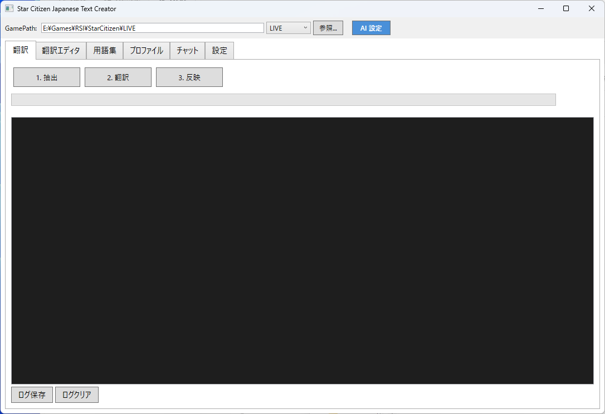

1. **GamePath** が正しいことを確認（自動検出済み）。チャンネル (PTU/LIVE) を選択
2. **[1. 抽出]** をクリック — Data.p4k から global.ini を抽出し DB に登録
3. **[2. 翻訳]** をクリック — 未翻訳テキストを AI に送信、複数バックエンドで並列翻訳
4. **[3. 反映]** をクリック — 翻訳結果を統合してゲームディレクトリに配置
5. Star Citizen を起動すれば日本語テキストが適用されます

---

### 2. AI 設定 — 翻訳バックエンドの設定

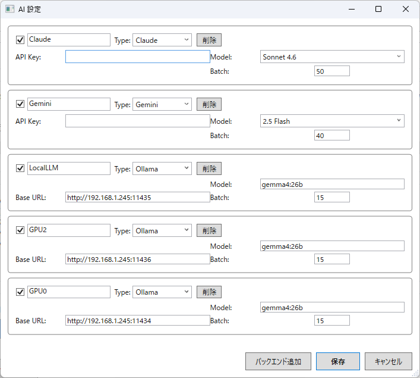

1. 画面右上の **[AI 設定]** ボタンをクリック
2. 各バックエンドの **チェックボックス** を有効にし、API キーやモデルを設定
3. **Batch** で一度に送る翻訳数を調整（VRAM やレート制限に応じて）
4. 複数バックエンドを有効にすると **並列翻訳** でスピードアップ
5. **[保存]** をクリック

> **チェックボックスは翻訳に使用するバックエンドの選択です。** チェックを入れたバックエンドが翻訳実行時に並列で使われます。
> **チャット (AI チャット / Web チャット) は別です。** 設定済みのバックエンドすべてがチャットタブのドロップダウンに表示され、その中から **1つを選んで** 使います。

#### バックエンドの追加

- **[バックエンド追加]** ボタンで同じプロバイダーを複数登録できます
- 例: OpenAI を 2 つ追加し、片方を `gpt-4.1-mini`（高速バッチ用）、もう片方を `gpt-4.1`（高品質用）に設定
- 異なる API キーを使い分けることで、レート制限を分散させることも可能です
- 不要なバックエンドは **[削除]** ボタンで削除できます

| バックエンド | 特徴 | 必要なもの |
|---|---|---|
| **Claude** (Anthropic) | 高品質な翻訳 | API キー ([取得方法](docs/API_Key_取得_Claude.md)) |
| **Gemini** (Google) | 高速・大量処理向き | API キー ([取得方法](docs/API_Key_取得_Gemini.md)) |
| **OpenAI** (ChatGPT) | 高品質・バランス型 | API キー ([取得方法](docs/API_Key_取得_OpenAI.md)) |
| **Ollama** (ローカル) | 無料・オフライン対応 | [Ollama](docs/Ollama_Install.md) + モデル |

---

### 3. 翻訳エディタ — 翻訳結果の確認・編集

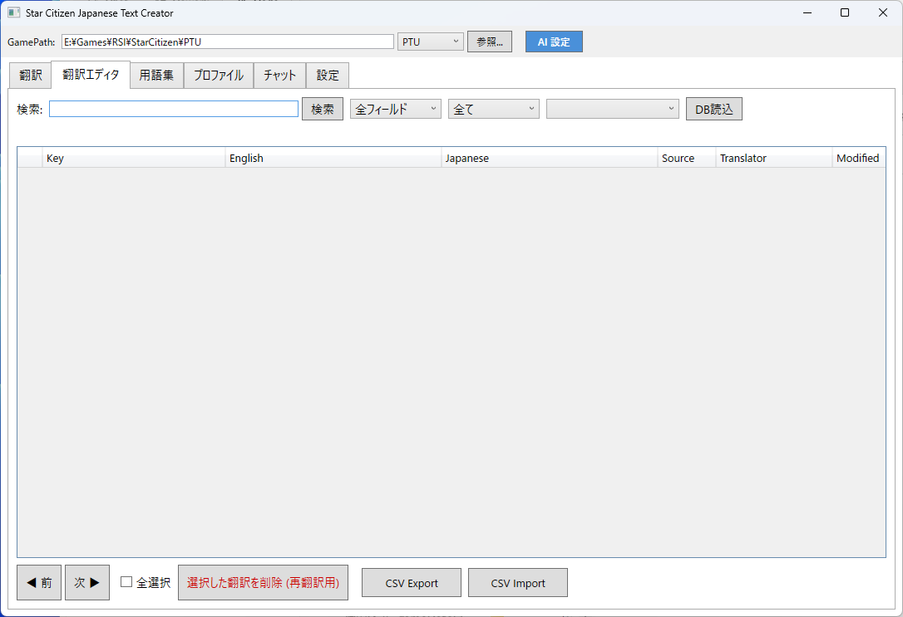

1. **翻訳エディタ** タブを開く（起動時にDBを自動読込）
2. **検索** バーでキーワード検索（ワイルドカード `*` `?` 対応）、**部分一致** チェックボックスで切替
3. **フィルタ** で Source (official/ai/manual/original) や Translator で絞り込み
4. **Japanese 列をダブルクリック** して翻訳を手動編集（手動修正は次回のDB読込でも保護されます）
5. 不満な翻訳はチェックボックスで選択 → **[選択した翻訳を削除]** で次回再翻訳
6. 船名・地名など英語のままにしたいキーは選択 → **[全て原文]** で英語原文を維持
7. **CSV Export / Import** で外部エディタとの連携も可能

---

### 4. 用語集 — 翻訳ルールの管理

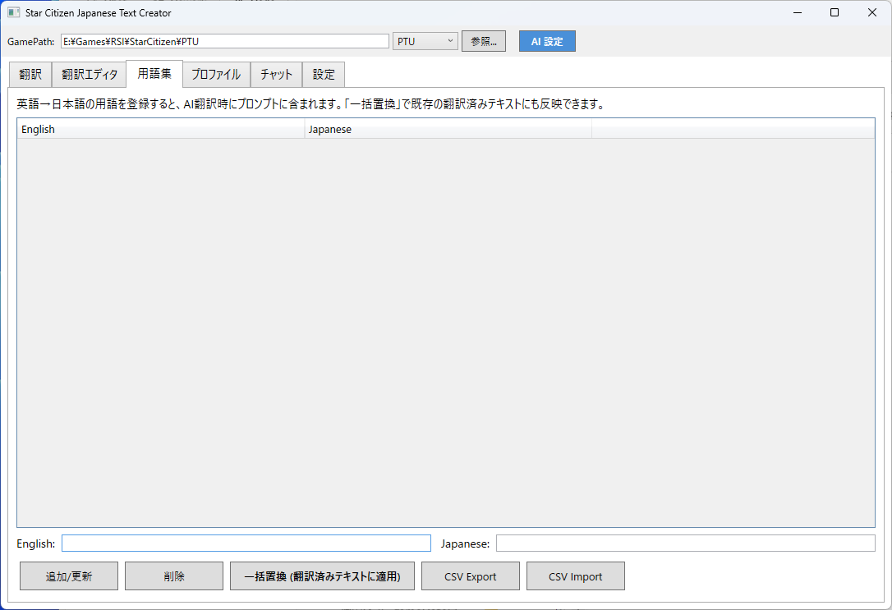

1. **用語集** タブを開く
2. 下部の **English** / **Japanese** フィールドに用語を入力
3. **[追加/更新]** をクリックして登録
4. 登録した用語は AI 翻訳時のプロンプトに自動挿入されます
5. **[一括置換]** で翻訳済みテキスト内の用語を正しい訳語に一括変換
6. チェックボックスで複数選択 → **[選択削除]** で一括削除
7. **CSV Export / Import** で用語集の一括管理も可能

> **誤訳の修正にも使えます。** 例えば AI が「Quantum Drive」を「量子ドライブ」と訳してしまった場合、English に `量子ドライブ`、Japanese に `クォンタムドライブ` と登録して **[一括置換]** を実行すると、翻訳済みテキスト内の誤訳がまとめて修正されます。カタカナを英語に戻したい場合も同様です。

---

### 5. プロファイル — バックアップ/リストア

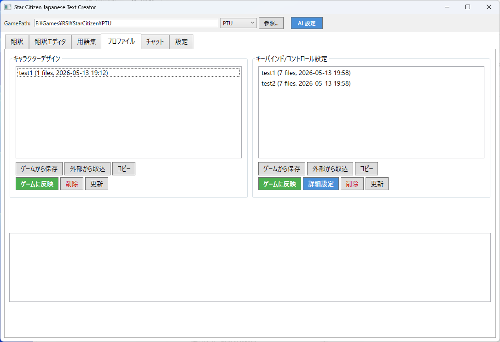

1. **プロファイル** タブを開く
2. **キャラクターデザイン** (左) と **キーバインド/コントロール設定** (右) を管理
3. **リストから復元したいプロファイルを1つ選択** してから操作します
4. **[ゲームから保存]** — 現在のゲーム設定をバックアップ
5. **[ゲームに反映]** — 選択したバックアップをゲームに復元
6. **[外部から取込]** — 他の人のファイルをインポート
7. **[詳細設定]** (コントロール側) — 選択したプロファイルのキーバインドエディタを開く

---

### 6. キーバインドエディタ — 機能別タブ

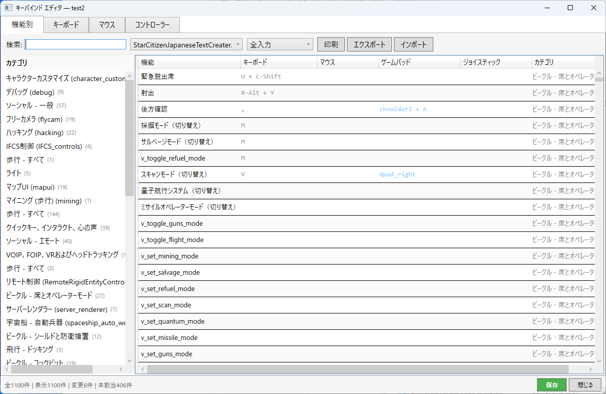

1. プロファイルタブでリストから保存済みプロファイルを **1つ選択** → **[詳細設定]** をクリック
2. **[機能別]** タブ: カテゴリ一覧（左）とバインド一覧（右）を表示
3. 左のカテゴリをクリックすると、そのカテゴリの機能に絞り込み
4. **検索** バーで機能名・キー名を検索
5. **入力フィルタ** でキーボード/マウス/ゲームパッド/未割当のみ等で絞り込み
6. 行をダブルクリックしてバインドを編集
7. 変更済みの行は黄色でハイライト、変更されたキーはオレンジ色で表示
8. **[エクスポート]** で XML / CSV に保存、**[インポート]** で読み込み

---

### 7. キーバインドエディタ — キーボード / マウス / ゲームパッド / HOTAS タブ

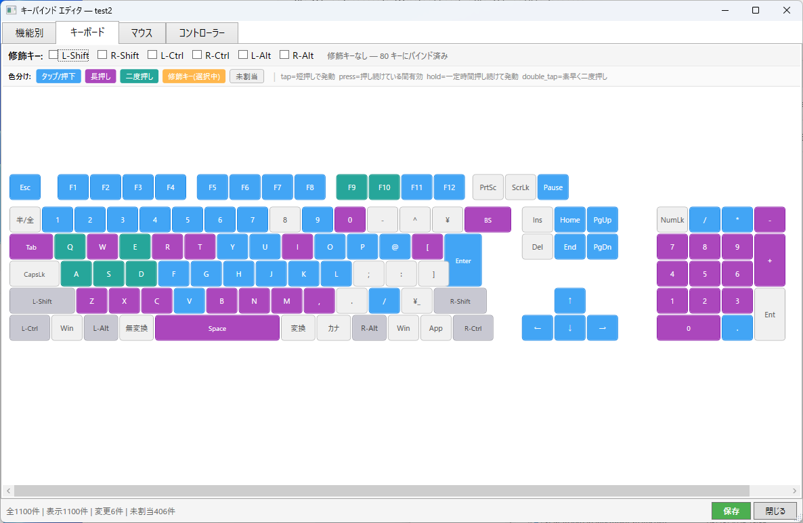

1. **[キーボード]** タブ: **日本語 109 キー配列** がビジュアル表示（テンキー付き）
2. **[マウス]** タブ: 左/右クリック・ホイール上下・中央・Mouse4/5・X/Y 軸をビジュアル表示。右側にマウスバインド全一覧
3. **[コントローラー]** タブ: Xbox コントローラーの A/B/X/Y・LB/RB・LT/RT・スティック・D-Pad をビジュアル表示。LB/RB 修飾ボタン対応
4. **[HOTAS]** タブ: VKB Gladiator NXT 左右の画像＋ボタングループ別バインドテーブル。画像クリックで拡大ビューア＋バインド編集パネル
5. **色分け** でバインドの種類が一目でわかります:
   - **青** = タップ / 押下中 (tap / press)
   - **紫** = 長押し (hold / delayed_hold)
   - **緑** = 二度押し (double_tap)
   - **オレンジ** = 修飾キー選択中
   - **グレー** = 未割当
6. **修飾キーのチェックボックス** をチェックすると、修飾キーとの組み合わせバインドを表示
7. ボタンに **マウスホバー** するとツールチップで割り当て済み機能一覧と activation mode を表示
8. ボタンを **クリック** すると割り当てダイアログが開き、機能を検索して割り当て/解除が可能
9. 機能名はゲーム内の **日本語翻訳データ (global.ini)** を参照して表示

---

### 8. AI チャット — ゲーム情報を日本語で質問

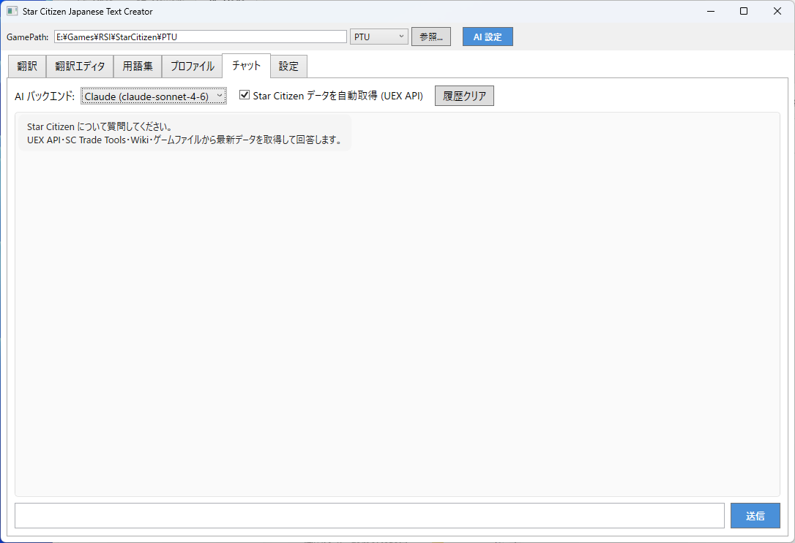

1. **チャット** タブを開く
2. **AI バックエンド** をドロップダウンで選択 (スキル対応バックエンド推奨)
3. テキストボックスに質問を入力して **[送信]**
4. AI が自動で必要なツール (スキル) を呼び出してデータを取得・回答
5. **[記憶管理]** ボタンでナレッジ管理ウィンドウを開く

#### AI 検索スキル (Tool Use)

| スキル | 検索できる内容 | 質問例 |
|---|---|---|
| **lookup** | 統合検索 (最初に呼ぶ) | 「ホーネットについて教えて」 |
| **search_location** | ステーション・施設 (精錬所・ハンガー等) | 「Everus Harbor の施設は？」 |
| **search_commodity** | 商品・資源＋場所別価格 | 「ラナイトの売値は？」 |
| **search_mission** | ミッション・契約 | 「賞金稼ぎのミッション一覧」 |
| **search_wiki** | Wiki からの詳細情報 | 「Carrack のスペックは？」 |
| **search_keybind** | キーバインド検索 | 「ドッキングのキーは何？」 |
| **remember** | ナレッジに情報を保存 | 「覚えて：○○はバグで動かない」 |
| **forget** | ナレッジから情報を削除 | 「直った：○○のバグ」 |

> 💡 バグ情報も AI に覚えさせると便利です。例:「覚えて：4.8 PTU で Lorville の Hangar エレベーターが動かない」→ 次に Lorville について質問したとき、AI が自動で注意してくれます。チームで DB を共有すれば全員が同じバグ情報を持てます。

---

### 9. Web チャット — ブラウザ・スマホから利用

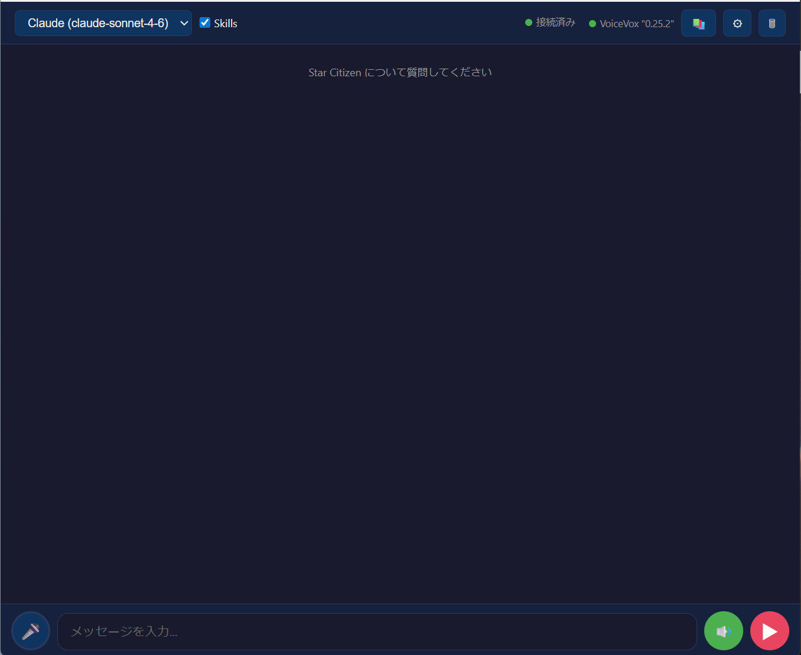

PC のブラウザやスマホから、AI チャットと VoiceVox 音声読み上げを利用できます。

#### 起動方法

1. **設定** タブで HTTP ポート (デフォルト: `8099`) と HTTPS ポート (デフォルト: `8100`) を確認
2. **[サーバー開始]** をクリック — HTTP と HTTPS が同時に起動します
3. 初回のみ **UAC プロンプト** が表示されます — **はい** をクリック (Windows ファイアウォールの開放とポート登録を自動で行います)
4. 以下の URL にアクセス:
   - **PC**: `http://localhost:8099/`
   - **LAN (他のデバイス)**: `http://192.168.x.x:8099/` (アプリに表示される URL)
   - **HTTPS PC**: `https://localhost:8100/`
   - **HTTPS LAN (マイク利用)**: `https://192.168.x.x:8100/` (スマホのマイクにはこちらが必要)

> **`192.168.x.x` の確認方法:** PC でコマンドプロンプトまたは PowerShell を開き `ipconfig` を実行します。「Wi-Fi」または「イーサネット」の **IPv4 アドレス** (例: `192.168.1.15`) がこの PC のアドレスです。スマホから同じ Wi-Fi に接続し、そのアドレスでアクセスしてください。

#### VoiceVox 音声読み上げ

- [VoiceVox](https://voicevox.hiroshiba.jp/) をローカルで起動しておく必要があります（無料）
- 画面右上の **緑のスピーカーボタン (🔊)** を押すと音声読み上げが **ON** になります（押さなければ読み上げません）
- ON の状態では: 質問送信時に「おまちください」、回答時に「お待たせしました」+ AI が生成した要約を読み上げ
- 歯車アイコンから話者 (キャラクター) を変更可能

#### スマホからの利用方法

スマホと PC が同じ Wi-Fi に接続されていれば、スマホのブラウザからチャットを利用できます。

**マイク (音声入力) を使わない場合:**

スマホのブラウザで `http://192.168.x.x:8099/` にアクセスするだけで利用できます。

**マイク (音声入力) を使う場合:**

Chrome はセキュリティ上、`localhost` 以外の HTTP ではマイクを許可しません。HTTPS が必要です。

1. アプリの **[サーバー開始]** をクリック — HTTP (8099) と HTTPS (8100) が同時に起動します
2. 初回のみ Windows の **UAC プロンプト** (管理者権限) が表示されます — **はい** をクリック (証明書のインストール、HTTPS ポートの登録、ファイアウォールの開放に必要)
3. 初回のみ Windows の **証明書インストール確認** が3回表示されます — すべて **はい** をクリック (自己署名証明書を PC の信頼済みストアに登録)
4. スマホのブラウザで `http://192.168.x.x:8099/cert` にアクセス
5. **[証明書をダウンロード]** をタップしてインストール:
   - **iPhone**: 設定 → 一般 → VPN とデバイス管理 → プロファイルをインストール → 設定 → 一般 → 情報 → 証明書信頼設定 → 有効化
   - **Android**: 設定 → セキュリティ → 証明書のインストール → CA 証明書 → ダウンロードしたファイルを選択
6. `https://192.168.x.x:8100/` にアクセス — マイクが使えるようになります

⚠️ **「この接続ではプライバシーが保護されません」と表示された場合:**

自己署名証明書を使用しているため、ブラウザが警告を表示することがあります。これは正常です。

- **PC (Chrome)**: **[詳細情報を表示しない]** をクリック → **[192.168.x.x にアクセスする（安全ではありません）]** をクリック
- **iPhone (Safari)**: **[詳細を表示]** → **[この Web サイトを閲覧]** をタップ
- **Android (Chrome)**: **[詳細設定]** → **[192.168.x.x にアクセスする（安全ではありません）]** をタップ

この警告は自宅 LAN 内の自己署名証明書によるものであり、通信自体は暗号化されています。一度アクセスを許可すれば、同じブラウザでは次回以降表示されません。

#### マイクが使えない場合 (Q&A)

**Q. マイクボタンを押しても反応しない / 「マイクの許可が必要です」と出る**

A. Chrome はセキュリティ上、`localhost` 以外では HTTPS 接続でないとマイクを許可しません。`https://192.168.x.x:8100/` でアクセスしてください (`http://` ではなく `https://`、ポートは `8100`)。

**Q. HTTPS でアクセスしてもマイクが使えない**

A. Chrome のアドレスバー左の鍵アイコン (または ⚠️ アイコン) をクリック → **マイク** の項目を確認してください。
- トグルが **OFF** になっている → **ON** に切り替え
- 「サイトアクセス時は常に許可」にチェックを入れると、次回以降の確認が不要になります
- 使用するマイクデバイスもここで選択できます

**Q. 「このサイトへの接続は保護されていません」と表示されるが問題ないか？**

A. 自己署名証明書を使っているため Chrome が警告を表示しますが、自宅 LAN 内の通信は暗号化されており問題ありません。マイクの利用には影響しません。

**Q. ゲーム用ヘッドセットなど、別のマイクを使いたい**

A. Chrome はデフォルトのマイクデバイスを使用します。切り替えるには:
1. アドレスバー左のアイコン (🔒 または ⚠️) をクリック
2. **マイク** の項目をクリック
3. ドロップダウンから使いたいマイクデバイスを選択
4. **「サイトアクセス時は常に許可」** にチェックを入れると次回以降の確認が不要になります

**Q. スマホでマイクが使えない**

A. 以下を確認してください:
1. `https://` でアクセスしているか (ポートは HTTPS 用の `8100`)
2. 証明書をスマホにインストール済みか (`http://192.168.x.x:8099/cert` からダウンロード)
3. ブラウザのマイク許可を求めるポップアップで **許可** を選択したか
4. スマホの設定 → アプリ → Chrome (または Safari) → マイクが有効か

> 証明書はこの PC 専用の自己署名証明書です。外部の認証局は使用しません。不要になったらスマホから削除してください。
>
> ファイアウォールは「SC Japanese Assistant HTTP」「SC Japanese Assistant HTTPS」というルール名で自動登録されます。アンインストール時は Windows Defender ファイアウォール → 受信の規則 から手動で削除してください。

---

### 10. ナレッジ (記憶) — AI にバグ情報や Tips を教える

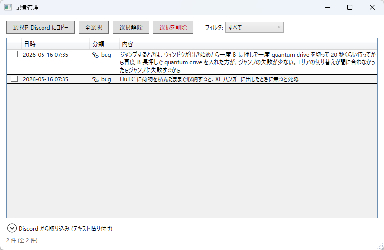

AI に情報を教えて記憶させることができます。保存した情報は毎回のチャットに自動で読み込まれます。

- **保存**: チャットで「覚えて：Hull C に荷物を積んだまま収納すると XL ハンガーで死ぬ」→ AI が SQLite に保存
- **削除**: 「直った：○○のバグ」「忘れて：○○」で削除
- **管理 UI**: アプリの **[記憶管理]** ボタン、または Web チャットのモーダルから一覧・編集・削除
- カテゴリ: バグ (bug)・用語 (term)・Tips (tip)・一般 (general)
- フィルタでカテゴリ別に表示、選択して一括削除も可能

#### Discord 連携

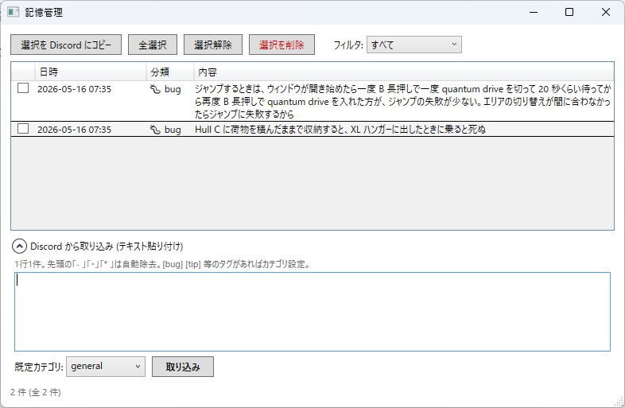

- **[選択を Discord にコピー]** — 選択したナレッジをカテゴリ別にまとめた Discord マークダウンとしてクリップボードにコピー
- **Discord から取り込み** (画面下部を展開) — Discord やテキストファイルからコピペで一括インポート。先頭の `- ` や `[bug]` タグを自動認識

---

### 11. 設定タブ — Web チャット・VoiceVox・データベース管理

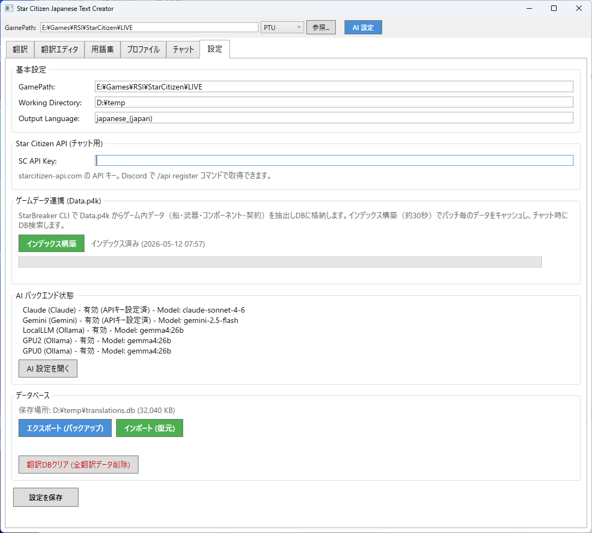

1. **基本設定**: GamePath・Working Directory・Output Language を確認・変更
2. **ゲームデータ連携**: **[インデックス構築]** で Data.p4k からゲームデータを抽出・キャッシュ
3. **Web チャット**: HTTP ポート (8099) と HTTPS ポート (8100) を設定し **[サーバー開始]** でブラウザ/スマホからアクセス可能に
4. **VoiceVox URL**: VoiceVox の接続先 (デフォルト: `http://localhost:50021`)、話者 ID を設定
5. **データベース**:
   - **[エクスポート (バックアップ)]** — 翻訳 DB・ナレッジを含む全データを ZIP で保存
   - **[インポート (復元)]** — バックアップ ZIP を読み込み (翻訳・用語集・インデックス・記憶データを選択可)
6. **[設定を保存]** で変更を反映

> **Working Directory に保存されるファイル:**
>
> | ファイル / フォルダ | 内容 |
> |---|---|
> | `translations.db` | 翻訳データベース (SQLite) — 翻訳テキスト・用語集 |
> | `gamedata_cache.db` | ゲームデータキャッシュ (SQLite) — インデックス・ナレッジ (記憶) |
> | `saves/characters/` | キャラクターデザインのバックアップ (`*.blob` ファイル) |
> | `saves/controls/` | キーバインド設定のバックアップ (`*.xml` ファイル) |
> | `output/global.ini` | 統合済み翻訳ファイル (ゲームに配置される) |
> | `chat_debug.log` | チャット機能のデバッグログ |

---

## Ollama + Gemma4 の設定方法

ローカル LLM を使えば **API キー不要・無料** で翻訳できます。

**1. Ollama をインストール** ([詳細ガイド](docs/Ollama_Install.md))

[ollama.com](https://ollama.com/) からインストーラーをダウンロード・実行します。

**2. 翻訳用モデルをダウンロード**

```bash
# 高品質モデル (VRAM 4GB 以上推奨)
ollama pull gemma4:4b

# 軽量モデル (VRAM 2GB でも動作)
ollama pull gemma4:2b
```

> VRAM に余裕があれば `gemma4:26b` (高精度) や `gemma4:12b` (バランス型) も使えます。

**3. AI 設定ダイアログで設定**

| 項目 | 設定値 | 説明 |
|---|---|---|
| **Type** | `Ollama` | ドロップダウンから選択 |
| **Base URL** | `http://localhost:11434` | Ollama のアドレス (別 PC の場合は IP を変更) |
| **Model** | `gemma4:4b` or `gemma4:2b` | ダウンロードしたモデル名を入力 |
| **Batch** | `15` | 一度に送る翻訳数 (VRAM に応じて調整) |

**4. Ollama のコンテキスト長を増やす (重要)**

Ollama のデフォルトコンテキスト長 (2048 トークン) では、翻訳プロンプト＋固有名詞リストが収まりきらずパースエラーになる場合があります。以下のいずれかで対処してください:

- **方法 A: 環境変数で設定** — Ollama 起動前に `OLLAMA_NUM_CTX=8192` を設定
- **方法 B: Modelfile でカスタムモデルを作成**:

  ```bash
  ollama create gemma4-8k -f - <<EOF
  FROM gemma4:4b
  PARAMETER num_ctx 8192
  EOF
  ```

  作成後、AI 設定の Model に `gemma4-8k` を指定

> **翻訳がパースエラーで失敗する場合**: ログに「パース失敗 (0行)」と表示される場合、コンテキスト長不足が原因の可能性があります。上記の方法でコンテキスト長を 8192 以上に増やしてください。Batch を減らす (1〜5) ことでも改善する場合があります。
>
> **VRAM に関する注意**: Ollama (Gemma4) はGPUのVRAMを使用します。Star Citizen もVRAMを大量に消費するため、**ゲームプレイ中に翻訳やチャットを実行するとVRAMが圧迫され、ゲームのパフォーマンスが低下する場合があります**。ゲーム中の使用を避けるか、軽量モデル (`gemma4:2b`) を使用するか、別PCのOllamaに接続することを推奨します。Claude / Gemini などのクラウドAPIを使用する場合はVRAMへの影響はありません。
>
> **VRAM 使用量の確認方法:**
> - **NVIDIA**: タスクマネージャー → パフォーマンス → GPU → 「専用 GPU メモリ使用量」を確認。またはコマンドで `nvidia-smi` を実行
> - **AMD**: タスクマネージャー → パフォーマンス → GPU → 「専用 GPU メモリ使用量」を確認。またはコマンドで `rocm-smi` を実行 (ROCm インストール時)
> - Star Citizen 起動中は通常 6〜10GB の VRAM を使用します。`gemma4:2b` は約 2GB、`gemma4:4b` は約 4GB の VRAM を追加消費します

---

## データ保存先

全てのデータは Working Directory (設定タブで変更可能) に保存されます。

| ファイル | 内容 |
|---|---|
| `translations.db` | 翻訳データベース (SQLite) — 翻訳テキスト・用語集 |
| `gamedata_cache.db` | ゲームデータキャッシュ (SQLite) — ゲームデータ・ナレッジ (記憶) |
| `saves/characters/` | キャラクターデザインのバックアップ |
| `saves/controls/` | キーバインド設定のバックアップ |
| `output/global.ini` | 統合済み翻訳ファイル |
| `chat_debug.log` | チャット機能のデバッグログ |

---

## ゲームデータ連携 (Data.p4k / StarBreaker)

設定タブの **「インデックス構築」** で、ローカルの Data.p4k からゲーム内データのインデックスを構築します。

- **StarBreaker CLI** (約 4MB) は初回実行時に自動ダウンロードされます
- インデックス構築は約 30 秒で完了します
- **ゲームパッチ適用後は必ずインデックスを再構築してください**
- チャットで質問すると、該当するエンティティの詳細をオンデマンドで取得します

---

## セットアップガイド

### API キー取得

| バックエンド | ガイド |
|---|---|
| **Claude** (Anthropic) | [API_Key_取得_Claude.md](docs/API_Key_取得_Claude.md) |
| **Gemini** (Google) | [API_Key_取得_Gemini.md](docs/API_Key_取得_Gemini.md) |
| **OpenAI** (ChatGPT) | [API_Key_取得_OpenAI.md](docs/API_Key_取得_OpenAI.md) |

### ローカル LLM (Ollama)

| ドキュメント | 内容 |
|---|---|
| [Ollama_Install.md](docs/Ollama_Install.md) | Ollama 本体のインストール |
| [Gemma4_e4b_Install.md](docs/Gemma4_e4b_Install.md) | 高品質モデル (4B) |
| [Gemma4_e2b_Install.md](docs/Gemma4_e2b_Install.md) | 軽量モデル (2B) |

---

## ビルド方法

```bash
git clone https://github.com/batake321/StarCitizenJapaneseTextCreater.git
cd StarCitizenJapaneseTextCreater
dotnet build -c Release
```

---

## 利用している外部サービス

| サービス | 用途 |
|---|---|
| **[StarBreaker](https://github.com/diogotr7/StarBreaker)** | Data.p4k DCB クエリ |
| **[UEX Corp](https://uexcorp.space/)** | 機体・商品・価格データ |
| **[Star Citizen Wiki API](https://api.star-citizen.wiki/)** | ステーション施設・アメニティ情報 |
| **[SC Trade Tools](https://sc-trade.tools/)** | アイテム詳細・取引ショップ |
| **[starcitizen.tools](https://starcitizen.tools/)** | Wiki (MediaWiki API) |
| **Anthropic Claude API** | AI 翻訳・チャット |
| **Google Gemini API** | AI 翻訳・チャット |
| **OpenAI API** | AI 翻訳・チャット |
| **[Ollama](https://ollama.com/)** | ローカル LLM |
| **[VoiceVox](https://voicevox.hiroshiba.jp/)** | 音声読み上げ (Web チャット) |

### 注意事項

- **Star Citizen** は Cloud Imperium Games (CIG) の著作物です
- ゲームデータの抽出・解析はファンによるローカライズ目的での利用を想定しています
- 各外部 API は非公式のコミュニティ運営サービスであり、サービスの可用性は保証されません

## ライセンス

MIT License
